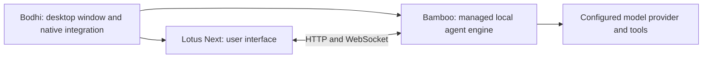

# Bodhi AI

[中文](README.zh-CN.md) · [Download desktop app](https://github.com/bigduu/Bodhi-AI/releases/latest) · [Development guide](docs/development.md)

**A desktop home for your local AI agent.** Bodhi brings the [Zenith](https://github.com/bigduu/Zenith) agent harness to a native window: use Lotus Next to work with conversations and tools, while Bodhi starts and stops the local Bamboo engine for you.

Use it when you want to work with an agent on a project without keeping a backend terminal open. The UI lets you follow messages, tool activity and approval requests; the desktop shell adds a global shortcut and system notifications. A model provider is still required for AI responses. Local execution does not mean your chosen model runs locally or that requests never leave your machine.

## Try the desktop app

1. Download the installer matching your platform from [Releases](https://github.com/bigduu/Bodhi-AI/releases/latest).
2. Install and launch Bodhi AI. It starts its bundled Bamboo engine and opens its packaged Lotus Next interface.
3. Open **Settings → Providers**, configure a provider you can access, then start a conversation. A useful first task is to explain a small sample project before requesting file changes.

| Platform | Published installer formats |
|---|---|
| macOS, Apple Silicon or Intel | Architecture-specific `.dmg` |
| Windows, x64 | `-setup.exe` |
| Linux, x64 | `.deb`, `.AppImage`, `.rpm` in the audited release |

The table reflects [app-v2026.9.20](https://github.com/bigduu/Bodhi-AI/releases/tag/app-v2026.9.20), the latest public release observed on 2026-10-03. It is an artifact inventory, not a claim that every OS was tested in this documentation refresh. Linux needs a graphical session and the platform's WebKitGTK/runtime dependencies. For source builds, follow the [Tauri platform prerequisites](https://v2.tauri.app/start/prerequisites/).

## Install on macOS with Homebrew

```sh
brew tap bigduu/tap
brew trust bigduu/tap
brew install --cask bigduu/tap/bodhi
```

`brew trust` explicitly trusts this third-party tap, including future packages from it, so Homebrew can load the cask's formula dependencies. The [Bodhi cask](https://github.com/bigduu/homebrew-tap) selects the Apple Silicon or Intel DMG and installs the **Jiandu** and **Nova** command-line tools. Bodhi already bundles its Bamboo engine. Installing Jiandu and Nova does not configure an MCP host; Nova also needs macOS permissions for computer control.

**Current macOS signing:** the published DMG is ad-hoc signed and is not Developer ID notarized. During Homebrew installation, the cask automatically removes quarantine from the installed app, re-signs it locally with an ad-hoc signature while preserving the hardened runtime, and verifies the signature. No manual self-sign step is needed for this installation path. This does not provide Developer ID trust or notarization, and macOS privacy permissions may need to be granted again after upgrades. Direct DMG installations can use [the self-sign script](./scripts/self-sign-macos-app.sh); formal signing is tracked in [Bodhi #75](https://github.com/bigduu/Bodhi-AI/issues/75).

## Work with it

- **Return to your work quickly:** `Cmd+Shift+Space` on macOS or `Ctrl+Shift+Space` on Windows/Linux toggles the main window, when the OS allows the shortcut.
- **Keep execution visible:** Lotus Next presents conversations, tool calls and permission prompts; Bamboo performs the work. Available tools and workflows depend on the bundled runtime and your configuration.
- **Use the same engine from a terminal:** **Help → 安装 bamboo 命令行工具…** exposes the bundled CLI on your PATH. Then try `bamboo --help` or `bamboo tui`. On macOS, installation into `/usr/local/bin` may request administrator permission; Windows updates user PATH, and Linux uses `~/.local/bin`.
- **Manage one local engine:** closing the app shuts down its owned sidecar. The default backend port is `9562`; an occupied port is reported instead of taking over another process. `BODHI_BACKEND_PORT` selects a different port.

## How the pieces fit



Bodhi packages a startup page, verified frontend resources and a standalone `bamboo serve` sidecar. It does not link the Bamboo runtime as a Rust library. [Nova](https://github.com/bigduu/nova) provides separately configured computer/browser tools; installing the shell alone does not establish that those tools are ready. [bodhi-server](https://github.com/bigduu/bodhi-server) is a separate service for hosted account/proxy use, not the local engine.

## Source checkout versus released app

The README describes the Zenith-pinned source. As checked on 2026-10-03:

| Layer | Identity | Frontend selection |
|---|---|---|
| Public desktop release | `app-v2026.9.20` | Lotus Next `2026.9.16` |
| Zenith-pinned Bodhi source | `6d85036` | Lotus Next `2026.9.22` in the package lock |
| Upstream `main` observed | `d0e40e8` | Contains changes after the Zenith pin |

A newer npm frontend does not update an already released desktop installer. Source manifests use `0.0.0` intentionally; the release workflow supplies the app version. See [evidence and limits](docs/readme-audit.md). Features on other branches are not advertised as released here.

## Develop from Zenith

Initialize Zenith's submodules at its recorded pins, then install both UI and shell dependencies. Use Node.js 22.12+ (Lotus Next's declared minimum), npm, Rust 1.95+ (the pinned Bamboo requirement) and the platform-specific Tauri prerequisites.

```bash
# From the Zenith checkout
(cd lotus-next && npm ci)
cd bodhi
npm ci
npm run tauri:dev
```

This uses sibling `../lotus-next` and `../bamboo`. The development command builds the real API-only Bamboo sidecar and frontend resources; it is not a UI-only preview. Lotus HMR uses port `1420`, and Bamboo uses `9562` by default.

```bash
npm run tauri:build     # Assemble a production desktop bundle
npm run test:build      # Source-selection and assembly tests (no Cargo)
```

For browser-only development, use the [Lotus Next README](https://github.com/bigduu/lotus-next). Detailed source selection, package verification, diagnostics, public/internal modes and isolated macOS restart acceptance remain in the [development guide](docs/development.md).
