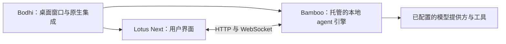

# Bodhi AI

[English](README.md) · [简体中文](README.zh-CN.md)

**跑在你电脑上的 AI Agent，装进一个桌面窗口。** 交给它任务，每一次工具调用和权限确认都看得见，
不用一直开着后端终端。Bodhi 会替你启动和关闭内置的 Bamboo agent 运行时，并打开 Lotus Next 界面。

[下载](https://github.com/bigduu/Bodhi-AI/releases/latest) · [Bodhi / Zenith 总仓库](https://github.com/bigduu/Zenith) · [开发指南](docs/development.zh-CN.md) · [MIT 开源](LICENSE)

<p align="center"></p>

*在浏览器中连接 Bamboo 源码录制的 Lotus Next，使用演示数据，没有调用模型。打包的应用可能使用更早的 Lotus Next 版本。*

- **直接处理你的项目**：读写文件、执行命令、搜索和抓取网页，高风险操作前会先征求你的同意。
- **能按计划持续干活**：内置的 Bamboo 运行时支持定时任务和工作流。
- **模型自己选**：Anthropic、OpenAI（以及兼容 OpenAI 接口的服务）、Gemini 或 GitHub Copilot。
- **用 MCP 扩展**：通过 Homebrew 安装时还会装上[简牍 Jiandu](https://github.com/bigduu/Jiandu)
  （共享记忆）和 [Nova](https://github.com/bigduu/Nova)（操作原生应用）两个命令行工具，可以作为
  MCP 服务接入。

## 安装

| 平台 | 方式 |
|---|---|
| macOS（推荐） | `brew tap bigduu/tap && brew trust bigduu/tap && brew install --cask bigduu/tap/bodhi` |
| macOS（手动） | 从 [Releases](https://github.com/bigduu/Bodhi-AI/releases/latest) 下载 Apple Silicon 或 Intel 的 `.dmg`；暂未公证，需要运行[自签脚本](./scripts/self-sign-macos-app.sh)，或者改用 Homebrew |
| Windows x64 | `-setup.exe`（未签名，SmartScreen 可能会提示） |
| Linux x64 | `.AppImage`、`.deb` 或 `.rpm`（需要图形会话和 WebKitGTK 运行时） |

装好后打开 **设置 → 提供方**，填入你能用的模型服务商的 Key，然后试试：*“解释一下这个文件夹，
再提一个小改进。”* 建议先用一个小的示例项目，再让它修改文件。AI 回复仍需要模型服务商：本地执行
不代表模型在本地运行，也不代表请求不会离开你的电脑。

表格对应截至 2026-10-04 的最新公开版本 [app-v2026.9.20](https://github.com/bigduu/Bodhi-AI/releases/tag/app-v2026.9.20)，表示有这些发布产物，不表示本次文档更新实测了所有平台。源码构建请遵循 [Tauri 平台前置要求](https://v2.tauri.app/start/prerequisites/)。

### Homebrew 安装说明

```sh
brew tap bigduu/tap
brew trust bigduu/tap
brew install --cask bigduu/tap/bodhi
```

`brew trust` 会明确信任这个第三方 tap，包括它未来发布的包，使 Homebrew 能加载 Bodhi cask 依赖的 formula。[Bodhi cask](https://github.com/bigduu/homebrew-tap) 会按 Apple Silicon 或 Intel 机型选择 DMG，并安装 **Jiandu** 和 **Nova** 命令行工具；Bodhi 已内置 Bamboo 引擎。安装 Jiandu 和 Nova 不会自动配置 MCP host；Nova 的电脑控制功能还需要相应的 macOS 权限。

**当前 macOS 签名方式：** 已发布的 DMG 使用 ad-hoc 签名，尚未取得 Developer ID 公证。通过 Homebrew 安装时，cask 会自动移除已安装应用的 quarantine 标记，在保留 hardened runtime 的同时进行本机 ad-hoc 自签，并校验签名；此安装方式无需手动执行自签脚本。这不等于获得 Developer ID 信任或公证，升级后也可能需要重新授予 macOS 隐私权限。直接安装 DMG 时可使用[自签脚本](./scripts/self-sign-macos-app.sh)；正式签名与公证进度见 [Bodhi #75](https://github.com/bigduu/Bodhi-AI/issues/75)。

## 它如何帮助你工作

- **快速回到工作窗口：** macOS 使用 `Cmd+Shift+Space`，Windows/Linux 使用 `Ctrl+Shift+Space` 显示或隐藏窗口，需操作系统允许注册该快捷键。
- **看见执行过程：** Lotus Next 展示会话、工具调用与权限提示，Bamboo 执行任务。可用工具与工作流取决于随包运行时和你的配置。
- **在终端使用同一引擎：** **帮助 → 安装 bamboo 命令行工具…** 将随包 CLI 加入 PATH，之后可运行 `bamboo --help` 或 `bamboo tui`。macOS 写入 `/usr/local/bin` 可能请求管理员权限；Windows 更新用户 PATH；Linux 使用 `~/.local/bin`。
- **由应用管理本地引擎：** 退出应用会关闭其拥有的 sidecar。默认后端端口为 `9562`；端口被占用时会报错，不接管其他进程。可用 `BODHI_BACKEND_PORT` 选择其他端口。

## 各模块的关系



Bodhi 打包启动页、经过校验的前端资源和独立的 `bamboo serve` sidecar，不将 Bamboo 运行时作为 Rust 库链接。[Nova](https://github.com/bigduu/Nova) 提供需单独配置的电脑/浏览器工具；仅安装桌面外壳不代表这些工具已经就绪。[bodhi-server](https://github.com/bigduu/bodhi-server) 是托管账号/代理场景的独立服务，不是本地执行引擎。

## 源码与已发布应用的区别

本 README 说明 Zenith 固定的源码。2026-10-03 核对结果：

| 层次 | 标识 | 前端选择 |
|---|---|---|
| 公开桌面版本 | `app-v2026.9.20` | Lotus Next `2026.9.16` |
| Zenith 固定的 Bodhi 源码 | `6d85036` | 包锁选择 Lotus Next `2026.9.22` |
| 观察到的上游 `main` | `d0e40e8` | 包含 Zenith pin 之后的改动 |

新的 npm 前端不会自动更新已经发布的桌面安装包。源码 manifest 中的 `0.0.0` 是有意保留的占位值，应用版本由发布流程注入。详见[核对证据与限制](docs/readme-audit.md)。其他分支上的功能不在这里宣传为已发布能力。

## 从 Zenith 开发

按 Zenith 记录的 pin 初始化子模块，再安装界面和外壳依赖。当前 macOS 源码构建需要 macOS 13.5+。需要 Node.js 22.12+（Lotus Next 声明的最低版本）、npm、Rust 1.95+（固定的 Bamboo 要求）以及对应平台的 Tauri 前置依赖。

```bash
# 从 Zenith 检出目录开始
(cd lotus-next && npm ci)
cd bodhi
npm ci
npm run tauri:dev
```

默认读取同级 `../lotus-next` 和 `../bamboo`。开发命令会构建真实的 API-only Bamboo sidecar 和前端资源，并非仅预览 UI。Lotus HMR 使用端口 `1420`，Bamboo 默认使用 `9562`。

```bash
npm run tauri:build     # 装配生产桌面包
npm run test:build      # 来源选择与装配测试，不调用 Cargo
```

仅在浏览器中开发请参阅 [Lotus Next README](https://github.com/bigduu/lotus-next)。来源选择、包验证、诊断、内置浏览器 runtime以及隔离的 macOS 重启验收说明保留在[开发指南](docs/development.zh-CN.md)。

## 许可证

项目自有代码和文档采用 [MIT 许可证](./LICENSE)。第三方组件保留各自的许可证和版权声明。
