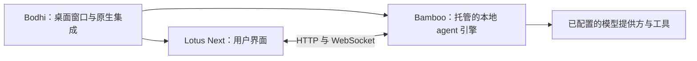

# Bodhi AI

[English](README.md) · [下载桌面应用](https://github.com/bigduu/Bodhi-AI/releases/latest) · [开发指南](docs/development.zh-CN.md)

**把本地 AI agent 带到桌面。** Bodhi 是 [Zenith](https://github.com/bigduu/Zenith) 本地 agent harness 套件的桌面入口：通过 Lotus Next 操作会话与工具，由 Bodhi 为你启动和关闭本地 Bamboo 引擎。

适合希望让 agent 协助项目工作、又不想一直维护后端终端的用户。界面展示消息、工具活动和审批请求；桌面外壳提供全局快捷键与系统通知。AI 回复仍需可用的模型提供方。本地执行不代表模型一定运行在本地，也不代表请求不会离开设备。

## 开始使用

1. 从 [Releases](https://github.com/bigduu/Bodhi-AI/releases/latest) 下载适合平台的安装包。
2. 安装并启动 Bodhi AI。它会启动随包提供的 Bamboo 引擎，并打开打包的 Lotus Next 界面。
3. 打开 **设置 → 提供商**，配置你有权限访问的模型提供方，再开始会话。可以先让它解释一个小型示例项目，再尝试修改文件。

| 平台 | 已发布安装包格式 |
|---|---|
| macOS，Apple Silicon 或 Intel | 按架构选择 `.dmg` |
| Windows，x64 | `-setup.exe` |
| Linux，x64 | 核对版本包含 `.deb`、`.AppImage`、`.rpm` |

表格对应截至 2026-10-03 查到的最新公开版本 [app-v2026.9.20](https://github.com/bigduu/Bodhi-AI/releases/tag/app-v2026.9.20)，表示有这些发布产物，不表示本次文档更新实测了所有平台。Linux 需要图形会话及对应的 WebKitGTK/运行时依赖。源码构建请遵循 [Tauri 平台前置要求](https://v2.tauri.app/start/prerequisites/)。

## 它如何帮助你工作

- **快速回到工作窗口：** macOS 使用 `Cmd+Shift+Space`，Windows/Linux 使用 `Ctrl+Shift+Space` 显示或隐藏窗口，需操作系统允许注册该快捷键。
- **看见执行过程：** Lotus Next 展示会话、工具调用与权限提示，Bamboo 执行任务。可用工具与工作流取决于随包运行时和你的配置。
- **在终端使用同一引擎：** **帮助 → 安装 bamboo 命令行工具…** 将随包 CLI 加入 PATH，之后可运行 `bamboo --help` 或 `bamboo tui`。macOS 写入 `/usr/local/bin` 可能请求管理员权限；Windows 更新用户 PATH；Linux 使用 `~/.local/bin`。
- **由应用管理本地引擎：** 退出应用会关闭其拥有的 sidecar。默认后端端口为 `9562`；端口被占用时会报错，不接管其他进程。可用 `BODHI_BACKEND_PORT` 选择其他端口。

## 各模块的关系



Bodhi 打包启动页、经过校验的前端资源和独立的 `bamboo serve` sidecar，不将 Bamboo 运行时作为 Rust 库链接。[Nova](https://github.com/bigduu/nova) 提供需单独配置的电脑/浏览器工具；仅安装桌面外壳不代表这些工具已经就绪。[bodhi-server](https://github.com/bigduu/bodhi-server) 是托管账号/代理场景的独立服务，不是本地执行引擎。

## 源码与已发布应用的区别

本 README 说明 Zenith 固定的源码。2026-10-03 核对结果：

| 层次 | 标识 | 前端选择 |
|---|---|---|
| 公开桌面版本 | `app-v2026.9.20` | Lotus Next `2026.9.16` |
| Zenith 固定的 Bodhi 源码 | `6d85036` | 包锁选择 Lotus Next `2026.9.22` |
| 观察到的上游 `main` | `d0e40e8` | 包含 Zenith pin 之后的改动 |

新的 npm 前端不会自动更新已经发布的桌面安装包。源码 manifest 中的 `0.0.0` 是有意保留的占位值，应用版本由发布流程注入。详见[核对证据与限制](docs/readme-audit.md)。其他分支上的功能不在这里宣传为已发布能力。

## 从 Zenith 开发

按 Zenith 记录的 pin 初始化子模块，再安装界面和外壳依赖。需要 Node.js 22.12+（Lotus Next 声明的最低版本）、npm、Rust 1.95+（固定的 Bamboo 要求）以及对应平台的 Tauri 前置依赖。

```bash
# 从 Zenith 检出目录开始
(cd lotus-next && npm ci)
cd bodhi
npm ci
npm run tauri:dev
```

默认读取同级 `../lotus-next` 和 `../bamboo`。开发命令会构建真实的 API-only Bamboo sidecar 和前端资源，并非仅预览 UI。Lotus HMR 使用端口 `1420`，Bamboo 默认使用 `9562`。

```bash
npm run tauri:build     # 装配生产桌面包
npm run test:build      # 来源选择与装配测试，不调用 Cargo
```

仅在浏览器中开发请参阅 [Lotus Next README](https://github.com/bigduu/lotus-next)。来源选择、包验证、诊断、公开/内部模式以及隔离的 macOS 重启验收说明保留在[开发指南](docs/development.zh-CN.md)。
